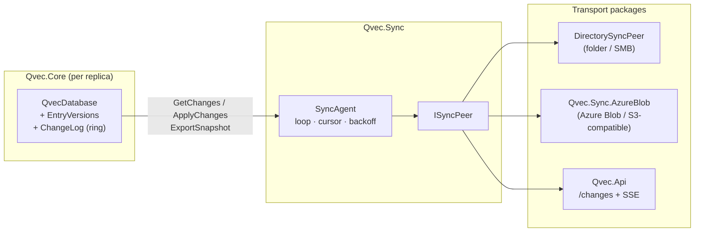

# Design: Sync Engine — replication between Qvec instances

Status: **implemented in 2.1** — change tracking in `Qvec.Core` (section 4), the `Qvec.Sync` package with `SyncAgent` and `DirectorySyncPeer` (sections 5.1–5.4) and the documentation/benchmarks are done; see the plan in [section 6](#6-implementation-plan) for what each PR delivered. Not yet built: `Qvec.Sync.AzureBlob` (5.5) and `Qvec.Api` as a hub (5.6). Where the text below says "shall"/"will", the implemented parts are described as designed; deviations discovered during implementation are noted inline. This document replaces an earlier proposal (Azure Append Blob + Web PubSub + wrapping `QvecSyncAgent`) that was rejected for the reasons in [section 2](#2-why-the-previous-proposal-was-rejected).

## 1. Goals and scope

Qvec is and remains an **in-process database in a single file**. Sync is an opt-in layer that lets multiple instances converge toward the same document set without any of them ceasing to work offline.

Goals:

- **Capture all writes in the core.** `AddEntry`, `AddEntries`, `UpdateVector`, `UpdateMetadata`, `Update`, `Delete` and `Vacuum` must all be tracked, regardless of which path the app took. No "write through the agent otherwise it does not sync".
- **Offline-first.** Writes and searches always happen locally. Sync runs when there is a peer to reach.
- **Deterministic conflict resolution** that does not depend on the network's arrival order or on synchronized clocks.
- **Transport-agnostic.** The same core mechanism must work against a folder/SMB share, an object store (Azure Blob, S3) and an HTTP hub (`Qvec.Api`). No cloud dependency in `Qvec.Core` or `Qvec.Sync`.
- **Bootstrap without reindexing.** A new node must be able to start from a copy of the `.qvec` file (incl. HNSW graph) instead of replaying history and rebuilding the graph.
- **AOT-clean.** No reflection-based serialization format on the hot path.

Non-goals (v1):

- Per-field merge of metadata. The document is the atom.
- Real time below 100 ms. Polling at second-level granularity is enough; push is an optimization at the transport level.
- Multi-master with causal guarantees. We promise *convergence* (all replicas end up in the same state), not that all intermediate states are visible.
- Encryption/signing of log segments. The storage layer's own access control is assumed to be enough in v1.

## 2. Why the previous proposal was rejected

| Deficiency | Consequence |
|---|---|
| Sync only via `QvecSyncAgent.AddEntryAsync` etc. | A `db.AddEntry` directly against the database silently does not sync. Divergence that is hard to detect. |
| Byte offset in a global Append Blob as cursor | Cannot be compacted, 50,000-block ceiling, new client must replay *all* history incl. deleted documents (~6.7 GB for 1M × 1536-dim). |
| No version per document | LWW is decided by the server's arrival order. A client that was offline and updated doc X locally has its newer change overwritten by an older remote change it fetches later. |
| Outgoing queue in memory | Crash between local write and send loses the change permanently. |
| Azure Functions + Append Blob + Web PubSub as the only path | Cloud lock-in in a library whose point is "no server". |
| No snapshot path | HNSW is rebuilt on every new node (170 s @ 1M on the reference machine) even though the file is already self-contained. |

Common denominator: **the core lacks replica identity, monotonic sequence and version per document**. That is what must be built first, and that is what makes the transport replaceable.

## 3. Architecture in brief



Three layers, three packages:

| Layer | Package | Responsibility |
|---|---|---|
| Change tracking | `Qvec.Core` | Version per document, ring log, `GetChanges`/`ApplyChanges`, snapshot export. No network dependencies. |
| Sync loop | `Qvec.Sync` | `SyncAgent`, `ISyncPeer`, cursor file, wire format, `DirectorySyncPeer`. Dependency: only `Qvec.Core`. |
| Transports | `Qvec.Sync.AzureBlob`, possibly `Qvec.Api` | Concrete peers. Isolated so that `Qvec.Sync` remains dependency-free. |

Topologies that fall out without extra code:

- **Serverless bus** — all replicas point at the same folder/blob container. Each replica writes under its own prefix, reads everyone else's.
- **Hub** — a `Qvec.Api` instance is the peer for all; the hub is itself a full-fledged, searchable replica.
- **Leader + read replicas** — hub where the edge nodes only pull. Bootstrap via snapshot gives an edge a ready HNSW graph.

## 4. The core: change tracking in the file format

### 4.1 New header fields (in reserved area, offset 184–511)

| Field | Type | Offset | Description |
|---|---|---|---|
| `ReplicaId` | Guid | 184 | This file's identity. Set at creation; replaced by `AdoptAsReplica`. |
| `ChangeSeq` | long | 200 | Last assigned local sequence number (monotonic, never reused). |
| `ChangeLogHead` | long | 208 | The ring's write position (record index). |
| `ChangeLogCount` | long | 216 | Number of valid records in the ring (≤ capacity). |
| `LastHlc` | long | 224 | Last issued HLC, for monotonicity across restart. |
| `TrackingEnabledUnixSeconds` | long | 232 | When tracking was switched on (diagnostics). |

New flag: `V4HeaderFlags.HasChangeTracking = 1 << 3`.

**Format version.** Files *without* tracking are still written as version 5 and remain readable by 2.0.0. Files *with* tracking are written as **version 6**. The reason is safety, not necessity: a 2.0.0 reader would open a version-5 file with tracking without error, write rows without updating the log and silently corrupt replication. Version 6 makes older readers reject the file with a clear error. A 2.1 reader reads 5 and 6.

### 4.2 New sections

| Section | Id | Element size | Flags | Content |
|---|---|---|---|---|
| `EntryVersions` | 11 | 24 B × `MaxCount` | Present, Mutable, MayMoveOnGrow | Per row: `Hlc` (8) + `Origin` (16). Written together with the row. |
| `ChangeLog` | 12 | 64 B × capacity | Present, Mutable, MayMoveOnGrow | Ring buffer of `ChangeRecord`. |

`ChangeRecord` (64 B):

```
offset  size  field
0       8     Seq          local sequence number
8       8     Hlc          version (see 4.3)
16      16    DocumentId
32      16    Origin       ReplicaId that created the version
48      1     Type         1=Upsert, 2=Delete
49      15    reserved (0)
```

The log does **not** carry payload. For `Upsert`, the current vector/metadata is fetched from the live row during `GetChanges`. That makes the log cheap (64 B/change, 64 MB for 1M records) and gives automatic coalescing: ten updates of the same document become one `Upsert` with the latest state. The price is that intermediate versions cannot be reconstructed — which is exactly the LWW semantics we want.

**Capacity** = `MaxCount` records by default (configurable via `ChangeTrackingOptions.LogCapacity`). Grows with `CreateGrown`. When the ring is full, the oldest is overwritten; a peer whose cursor points before `oldestSeq` gets `SyncCursorTooOldException` and must bootstrap via snapshot. It is the same trade-off as WAL retention in Postgres, and it must be stated in the README.

**Why a ring in the file and not a sidecar log?** Sidecar breaks the "one file" promise, loses atomicity with `CommitHeader`, and complicates `Vacuum`/`File.Move`. The ring only costs space.

### 4.3 Version: hybrid logical clock

`Hlc` is 64 bits: upper 48 = physical time in ms since Unix epoch, lower 16 = logical counter.

```
local event:         pt = max(nowMs, last.pt); c = (pt == last.pt) ? last.c + 1 : 0
received version v: pt = max(nowMs, last.pt, v.pt); c = pt == last.pt && pt == v.pt ? max(last.c, v.c)+1
                                                       : pt == last.pt ? last.c+1
                                                       : pt == v.pt    ? v.c+1 : 0
```

Total order: `(Hlc, Origin)` lexicographically. Two replicas can never issue the same `(Hlc, Origin)` because `Origin` differs. Clock skew is tolerated: a replica with the clock 10 min ahead "wins" conflicts during those ten minutes, but the system still converges and the HLC at the receivers jumps ahead so that their next write becomes newer. `LastHlc` is persisted in the header so that a restart never issues an older version than the most recently issued one.

### 4.4 Tombstones

Deleted slots are reused directly by `AllocateSlot`, so the row cannot carry the tombstone's version. Instead:

- `Delete` writes a `ChangeRecord` of type `Delete` with new `Hlc`.
- At `Open`, the ring is read and a `Dictionary<Guid, (Hlc, Origin)> _deletedVersions` is built for all `Delete` records whose document is not live.
- `ApplyChanges` with an `Upsert` for a document that exists in `_deletedVersions` with newer version → skipped (the deletion wins).
- Tombstone retention = the log's retention. A `Delete` record that has rotated out of the ring is forgotten; a peer that is that old bootstraps from snapshot anyway.

### 4.5 Local mutations

All already go through `_lock.EnterWriteLock()` and end with `CommitHeader()`. The addition per operation:

| Operation | Addition |
|---|---|
| `AddEntryInternal` | Stamp `EntryVersions[slot] = (NextHlc(), ReplicaId)`; append `Upsert`. |
| `UpdateVector` / `UpdateMetadata` / `Update` | New version on the new row; append `Upsert`. |
| `Delete` | Append `Delete` with new version; add to `_deletedVersions`. |
| `AddEntries` (parallel) | Versions and seq are taken under a short lock before the graph work; log append happens in insertion order within the batch. |
| `Vacuum` | Copies `EntryVersions` per live row, copies the ring and header fields unchanged to the new file. |
| `CreateGrown` | Lays out both sections with new capacity; copies the ring (packed, in seq order). |

Write order: row → version → log record → `CommitHeader` (bumps `ChangeSeq`, `ChangeLogHead`, `ChangeLogCount`, `LastHlc`). A record beyond `ChangeLogCount` after a crash is ignored, in the same way as a row beyond `CurrentCount`.

### 4.6 Applying remote changes

```csharp
public ApplyResult ApplyChanges(ChangeBatch batch);  // under write lock
```

Per entry in the batch:

1. Look up local version: live row → `EntryVersions`; otherwise `_deletedVersions`; otherwise "unknown".
2. If `remote.Version <= local.Version` → `Skipped` (idempotent; also applies to our own changes that come back via a peer).
3. `Upsert`: if the row is live → `Update` path (soft-delete + new row); otherwise `AddEntryInternal` with `externalId`. The version that is stamped is **the remote version**, not a new local one. An `Upsert` record is still appended in *our* log (with our `Seq`, remote `Hlc`/`Origin`) so that our own peers see the change.
4. `Delete`: soft-delete if the row is live; set `_deletedVersions[id] = remote.Version`; append `Delete`.
5. The HLC is "ticked" with the remote version (4.3) so that the next local write becomes newer.

`ApplyResult` returns `Applied`, `Skipped`, `Rejected` (for example dim error) per entry plus totals. Field index is updated if a `Func<string, IEnumerable<(string, string)>>` extractor is registered (new `db.FieldIndexExtractor` property; today the extractor is only passed to `RebuildFieldIndex`).

### 4.7 Reading changes

```csharp
public ChangeBatch GetChanges(long sinceSeq, int maxItems, Guid? excludeOrigin = null);  // under read lock
public long OldestChangeSeq { get; }
public long ChangeSeq { get; }
```

- Throws `SyncCursorTooOldException(oldestSeq)` if `sinceSeq < OldestChangeSeq - 1`.
- Walks the ring from `sinceSeq + 1` to `ChangeSeq`, coalesces per `DocumentId` (keep latest), skips records with `Origin == excludeOrigin` (avoids sending a peer's own changes back), and builds payload:
  - Live row → `Upsert` with floats (if the file has floats) or int8 codes + per-vector parameters (pure int8) + metadata.
  - Not live → `Delete`.
- `ChangeBatch.ToSeq` is the last included `Seq`; the client saves it as cursor only *after* successful push/apply.

### 4.8 Snapshot

```csharp
public SnapshotInfo ExportSnapshot(Stream destination);   // under write lock: commit header, copy the whole file from the mapping
public readonly record struct SnapshotInfo(Guid SourceReplicaId, long ChangeSeq, long Length);
public static void AdoptAsReplica(string path, Guid newReplicaId, out Guid sourceReplicaId, out long sourceSeq);
```

`ExportSnapshot` gives a bit-exact copy with `ReplicaId = source`, `ChangeSeq = N`. The receiver runs `AdoptAsReplica`, which changes `ReplicaId`, keeps all versions and the ring, and returns `(source, N)` so the agent can set the cursor `{source → N}`. From that point only the delta is pulled. No reindexing. The file is copied directly from the memory mapping because the open file is held with `FileShare.None`; writers are blocked during the copy, readers are not. `AdoptAsReplica` requires the file to be closed, refuses untracked files and refuses the same id the file already has (two replicas with the same identity would skip each other's writes as "own").

### 4.9 Activation on existing file

`db.EnableChangeTracking(ChangeTrackingOptions)` does a relayout (same mechanism as `CreateGrown`), sets `ReplicaId`, stamps all live rows with `(NextHlc(), ReplicaId)` and writes one `Upsert` record per row. The file becomes version 6. This is intentionally "one large initial change set": the first peer that pulls gets all documents. Documented.

### 4.10 Compatibility rules for payload

| Source | Payload | Receiver `None`/`Int8Rescored` | Receiver `Int8` |
|---|---|---|---|
| `None` / `Int8Rescored` | floats | ✅ | ✅ (quantizes locally) |
| `Int8` | codes + parameters | ❌ `Rejected` per entry, clear error | ✅ |

Dimensions must match; otherwise the whole batch is rejected. Distance function does not need to match (each replica indexes with its own).

### 4.11 Performance impact without sync

Tracking is **opt-in** — via `ChangeTrackingOptions` in the constructor or `EnableChangeTracking` on an existing file — and never on by default. A database that only runs in-process without peers ends up in one of two modes:

**Tracking off (default).** No impact. No new sections, the header fields are zero, the file remains version 5. Acceptance criterion for PR 1: new files without tracking are byte-identical to 2.0.0. The code path gets a single `if (_tracking)` branch per mutation; the search path is not touched.

**Tracking on, no peer.** The cost is this — and it must be measured in `sync-docs`, not asserted:

| Path | Impact | Comment |
|---|---|---|
| Search | **None.** | Neither `EntryVersions` nor `ChangeLog` is read on the query path. Same rule that keeps `MemoryMappedViewAccessor` away from there. |
| Write | +24 B version + 64 B log entry + one HLC tick (`UtcNow` and a few integer operations) per mutation. | Nanoseconds against an HNSW insertion in µs–ms. Benchmark `AddEntries` 1M with/without tracking decides. |
| Disk | +88 B per row (+ the ring's capacity). | 1536-dim float (6 KB/row): **1.4%**. 128-dim pure int8 (~130 B/row): **~70%** — must be stated in README. |
| `Open` | The ring is read once to build `_deletedVersions`. | O(log capacity); ~64 MB @ 1M records, tens of ms. |
| Memory | `_deletedVersions` grows with the number of deletions remaining in the ring. | ~40 B per entry. Emptied as `Delete` records rotate out. |
| `Vacuum` / grow | Copies two additional sections. | Sequential copy; marginal against requantization and graph writing. |

Rule for the implementation: all tracking work happens under the write lock that is already held, after the row is written and before `CommitHeader`. No new lock, no new allocation per mutation (the log entry is written directly in the mapping).

## 5. `Qvec.Sync`

### 5.1 `ISyncPeer`

```csharp
public interface ISyncPeer : IAsyncDisposable
{
    Guid PeerId { get; }                                                // Guid.Empty = bus (no single counterpart)
    Task<ChangeBatch?> PullAsync(SyncCursor cursor, int maxItems, CancellationToken ct);   // null = nothing new
    Task PushAsync(ChangeBatch batch, CancellationToken ct);
    Task<Stream?> OpenSnapshotAsync(SyncCursor cursor, CancellationToken ct); // null = not supported / does not exist; cursor.Self lets a bus skip its own snapshot
    Task PublishSnapshotAsync(Func<Stream, SnapshotInfo> export, CancellationToken ct);  // no-op allowed
    IAsyncEnumerable<SyncSignal> WatchAsync(CancellationToken ct);      // default: empty → the agent polls
}
```

`SyncCursor` is a vector clock `Dictionary<Guid, long>` (replica → last seen `Seq`) plus `Self`, the local replica's id — a cursor is "my view", so it knows who "I" am and the peer can skip the own prefix without knowing the agent. For a hub there is one entry; for a bus one per replica.

**Topology is decided by `PeerId`.** A hub has an identity and the agent pushes with `excludeOrigin: PeerId` (the hub already has its own changes). On a bus (`PeerId == Guid.Empty`), pushes happen without a filter: an `Upsert` that A received from B is also written to A's segment. That is redundant (C reads both A's and B's prefixes and skips idempotently) but correct, and requires no `onlyOrigin` variant of `GetChanges`. The redundancy can be removed in 2.x with an `onlyOrigin` filter without a format change.

### 5.2 `SyncAgent`

```csharp
await using var agent = new SyncAgent(db, peer, new SyncOptions
{
    StatePath = "local.qvec.sync",          // cursor + own push position, atomic write
    PollInterval = TimeSpan.FromSeconds(5),
    BatchSize = 500,
    BootstrapFromSnapshotIfBehind = true,
    FieldIndexExtractor = null,
});
await agent.StartAsync();
```

Loop per iteration (`SyncOnceAsync`, also callable directly without a background loop — this is how tests run):

1. **Push**: `db.GetChanges(state.PushedSeq, BatchSize, excludeOrigin)` → `peer.PushAsync` (only non-empty batches) → `state.PushedSeq = batch.ToSeq` → save state; repeat while `HasMore`.
2. **Pull**: `peer.PullAsync(state.Cursor)` → `db.ApplyChanges` → `cursor[batch.SourceReplicaId] = batch.ToSeq` → save state; repeat until `null`. A batch that does not move the cursor forward is a protocol error (`SyncProtocolException`), not an infinite loop.
3. **Snapshot publishing** (optional, `SnapshotInterval`): `peer.PublishSnapshotAsync(db.ExportSnapshot)`.
4. On `SyncCursorTooOldException` from **the peer** and `BootstrapFromSnapshotIfBehind`: fetch snapshot to `<db>.bootstrap`, close the database, `AdoptAsReplica` with **new** `ReplicaId`, replace the file, reopen, rebuild field index if `FieldIndexExtractor` exists, set cursor `{source → seq}` and `PushedSeq = seq`, reset other cursors to zero (their changes in the old file are gone; refetching skips idempotently). The agent then owns the `QvecDatabase` lifecycle: `agent.Database` is replaced and `DatabaseReplaced` is raised. Without the flag, the exception bubbles up via `IterationFailed`.
   A new id is necessary: the file's log is now the source's log, so other replicas' cursors against the old id would be meaningless.
5. On `SyncCursorTooOldException` from the **local** `GetChanges` (the ring has rotated past `PushedSeq`, i.e. more local mutations offline than `LogCapacity`): `SyncLogOverrunException`. The agent does not heal this itself — documents whose only log entry has rotated out can only reach peers via snapshot. Action: larger ring, or `PublishSnapshotAsync`.
6. Exponential backoff on errors (1 s → 60 s), reset on successful iteration. `IterationCompleted`/`IterationFailed` events.
7. `WatchAsync` signals short-circuit the wait until the next iteration.

The state file (`{ replicaId, pushedSeq, cursor, lastSnapshotUtc }`, System.Text.Json with source generator) is written with temp + rename. If it is missing, the agent starts with empty cursor and `PushedSeq = 0` (sends everything in the ring, the receiver skips idempotently). Corrupt file or file for another `replicaId` → `SyncStateException` with path; the agent does not guess.

### 5.3 Wire format `ChangeBatch`

Binary, versioned, AOT-clean (no reflection):

```
"QVCB" (4) | FormatVersion u16 = 1 | Compression u8 (0 = none, 1 = Brotli, 2 = reserved Zstd)
PayloadKind u8 (1=Float, 2=Int8) | Dim i32 | DistanceFunction u8 | HasMore u8 | Count i32
FromSeq i64 | ToSeq i64 | Origin Guid | BodyRawLength i32 | BodyStoredLength i32
Body (BodyStoredLength bytes): Count × { Type u8 | DocumentId 16 | Hlc i64 | Origin 16
      | Upsert: [Float: Dim × f32 | Int8: Dim × u8 + 16 params] MetadataLen i32 | UTF-8 }
Crc32 (4) over everything above
```

Body is compressed if `Compression != 0` — metadata compresses well, vectors barely; compression choice is the transport's business (`DirectorySyncPeer(root, SyncCompression.Auto)`): `Auto` chooses per batch based on metadata share (threshold 20%), `None`/`Brotli` force. `ChangeBatchWire.Read(Stream)` reads exactly one batch and leaves the position after it, so multiple batches can follow one another in a stream.

**Brotli versus Zstandard.** Zstd is technically better (3–5× faster compression at comparable ratio, dictionary support), but is not in the BCL until .NET 11 (`ZstandardStream/Encoder/Decoder`). On .NET 10 it would require `ZstdSharp` (managed, slower than native) or native binaries per platform — both conflict with Qvec's zero-dependency/AOT line. The payload is also dominated by float32 vectors that compress poorly regardless of codec, and sync batches are not CPU-critical. Therefore Brotli (`Quality = 4`, speed before ratio) now; `Compression = 2` is reserved so Zstd can be added on upgrade to net11 without a format break.

### 5.4 `DirectorySyncPeer`

Included in `Qvec.Sync`. Layout in the target folder:

```
<root>/
  replicas/<replicaId>/
    log/<fromSeq:D20>-<toSeq:D20>.qvcb      immutable segment
    snapshot/<seq:D20>.qvec                 optional, latest retained
  manifest/<replicaId>.json                 { latestSeq, snapshotSeq, updatedUtc }
```

`PushAsync` writes segment to `.tmp` and renames, then the manifest the same way. `PullAsync` lists `replicas/*` except `cursor.Self`, skips replicas whose manifest says `latestSeq <= cursor[replica]`, and returns the oldest segment with `toSeq > cursor[replica]` — one segment per call; `maxItems` is ignored because the segment size was set by the pushing agent. Overlapping segments (an agent that lost its state and pushed again from 0) are harmless thanks to idempotent apply. Segments are never deleted in v1 (no compaction), so a directory peer never throws `SyncCursorTooOldException`. `PublishSnapshotAsync` writes `snapshot/<seq>.qvec` via tmp + rename and deletes older ones; `OpenSnapshotAsync` chooses the foreign replica with highest `snapshotSeq`. `WatchAsync` is empty in v1. Works identically on local disk, SMB and — via `Qvec.Sync.AzureBlob` — in a blob container. This peer is also the **test transport**: two `QvecDatabase` in the same process, a temp folder, no network code.

### 5.5 `Qvec.Sync.AzureBlob`

Same layout as 5.4 over `BlobContainerClient`. Segments via `UploadAsync(overwrite: false)`; manifest via ETag-conditional write. Snapshot as block blob. `WatchAsync` = empty in v1 (polling). Separate NuGet package so that `Qvec.Sync` does not pull in `Azure.Storage.Blobs`.

### 5.6 `Qvec.Api` as hub (optional, later)

- `GET  /api/changes?since=&max=` → `ChangeBatch` (octet-stream)
- `POST /api/changes` → `ApplyResult`
- `GET  /api/snapshot` → file stream
- `GET  /api/changes/stream` → SSE with `{ "seq": N }` at every commit

`HttpSyncPeer` in `Qvec.Sync` (only `HttpClient`, no extra dependency). The hub never pulls — clients push and pull.

## 6. Implementation plan

Principles from earlier phases apply: **tests first**, zero warnings, fast CI + `Slow` suite green, one PR per row below, squash-merge, documentation in the same PR. All PRs except no. 6 are testable without network.

| # | Branch | Content | Tests (written first) | Done when |
|---|---|---|---|---|
| **1** ✅ #36 | `sync-versions` | Header fields 4.1, flag, format version 6 conditional on tracking, `EntryVersions` section, HLC class, `ReplicaId`. Stamping in all local mutations. `Vacuum`/`CreateGrown` preserve. `EnableChangeTracking` on empty and on existing file. | `Format/ChangeTrackingHeaderTests`: fields round-trip, CRC, v5 file without tracking is opened by 2.0.0 reader (simulated via version check), v6 is rejected by "old" reader. `HlcTests`: monotonicity, tick rules, `LastHlc` across restart. `EntryVersionTests`: version follows GUID through `UpdateVector`, survives `Vacuum` and grow. | All existing tests green; new files without tracking are byte-identical to 2.0.0; `AddEntries` 1M without tracking within measurement noise against 2.0.0 on the reference machine. |
| **2** ✅ #37 | `sync-changelog` | `ChangeLog` ring, `ChangeRecord`, `Delete` tombstones, `_deletedVersions`, `GetChanges` with coalescing and `excludeOrigin`, `ApplyChanges` with LWW, `OldestChangeSeq`, `SyncCursorTooOldException`. Field-index extractor as property. Remove `SyncFrom` (replaced; mark `[Obsolete]` in 2.1, remove in 3.0). | `ChangeLogTests`: append, rotation, crash simulation (record beyond count is ignored), packing on grow. `GetChangesTests`: coalescing, delete after upsert, cursor too old. `ApplyChangesTests`: idempotence, LWW both directions, delete wins over older upsert, upsert wins over older delete, own change back = skipped, dim error = rejected, int8→float = rejected, float→int8 = applied. **Convergence test**: two databases, randomized interleaved mutations offline, exchange batches in both directions until empty → identical `(Guid, Version, Metadata)` set. | Convergence test green for 1,000 iterations with seed logging. |
| **3** ✅ | `sync-snapshot` | `ExportSnapshot`, `AdoptAsReplica`. | Snapshot file opens, is healthy, has source `ReplicaId`/`ChangeSeq`; after `Adopt` new id, versions intact; delta from `sourceSeq` gives convergence without duplicates. | Bootstrap 1M file = file copy, no reindexing (Slow test measures). |
| **4** ✅ | `sync-agent` | New project `Qvec.Sync`: `ISyncPeer`, `SyncCursor`, `ChangeBatch` wire (5.3) with Brotli, `SyncAgent` (5.2) with state file and backoff, `DirectorySyncPeer` (5.4). NuGet metadata, AOT compilation in CI (like `Qvec.Core`). | `ChangeBatchWireTests`: round-trip, CRC error, version error, compressed/uncompressed. `DirectorySyncPeerTests`: segment names, tmp+rename, manifest, ignores own prefix. `SyncAgentTests` (in-process, temp folder): two agents converge; three agents in star; agent started without state sends everything and receiver skips; agent behind ring bootstraps from snapshot; corrupt state file → clear error; cancel midway → resumes. | Example in `samples/Qvec.Samples.Sync` that runs two processes against the same folder (`add`/`list`/`watch`). Noted: on a bus, applied foreign rows are re-advertised under own prefix and skipped by the others — a couple of quiet rounds before `DidWork` becomes false. |
| **5** ✅ | `sync-docs` | README: new section "Sync" with honest text about LWW, ring retention, clock skew and payload compatibility. `docs/design-format.md`: sections 11/12, header fields, version 6. `benchmarks/README.md`: cost of tracking (write throughput with/without). Roadmap updated. | Benchmark: `AddEntries` 1M with and without tracking; `GetChanges` 100k; `ApplyChanges` 100k. | No claimed figure without measurement on the reference machine. |
| **6** | `sync-azure-blob` | New package `Qvec.Sync.AzureBlob` with `BlobSyncPeer` (5.5). | Integration tests against Azurite in CI (`Slow`), same test suite as `DirectorySyncPeer` via shared abstract test class. | Published as own NuGet package. |
| **7** | `sync-api-hub` | `Qvec.Api` endpoints (5.6) + `HttpSyncPeer`. | `Qvec.Api.Tests` with `WebApplicationFactory`: push/pull/snapshot/SSE; auth via existing API key. | Optional; can be deferred until after release. |

**Release plan.** PR 1–5 ⇒ **2.1.0** (`Qvec.Core` + new `Qvec.Sync`). PR 6 ⇒ `Qvec.Sync.AzureBlob` 2.1.0. PR 7 ⇒ 2.2.0. `SyncFrom` is removed in 3.0.

**Dependency order.** 1 → 2 → 3 → 4 → 5 strictly. 6 and 7 are independent of each other but require 4.

**Estimated scope** (in the same unit as earlier phases, i.e. PRs of the size we have run): 1 and 2 are largest (core, format, convergence test); 3 small; 4 medium; 5 small but requires benchmark runs; 6 medium (Azurite setup); 7 medium.

## 7. Open questions

Decisions are proposed; deviation changes the plan above.

1. **Log capacity.** Proposal: `MaxCount` records (64 B each). Alternative: time-based retention — harder to guarantee in a ring; discouraged.
2. **Version 6 conditional on tracking** (4.1) versus always 6 in 2.1. Proposal: conditional, so that 2.0.0 readers can read untracked 2.1 files.
3. **Who owns `QvecDatabase` during snapshot bootstrap?** *Decision (PR 4):* the agent, but only when `BootstrapFromSnapshotIfBehind = true`. It reopens via `QvecDatabase.Open(db.FilePath)`, exposes `agent.Database` and raises `DatabaseReplaced`. No factory is needed because the file carries all parameters. Without the flag, `SyncCursorTooOldException` bubbles up and the app decides.
4. **`excludeOrigin` in bus topology.** *Decision (PR 4):* on the bus, everyone reads all prefixes and `excludeOrigin` is **not** used on push (only against hub). No separate `SyncTopology` enum: `ISyncPeer.PeerId == Guid.Empty` means bus. See 5.1.
5. **Pure int8 → float receiver** is rejected (4.10). Alternative: allow with dequantized vector and an `Approximate` flag in the version. Proposal: reject in v1; it is more honest.
6. **`AddEntries` parallel + log.** Log append in insertion order requires seq to be taken in order, but graph work can happen in parallel. Proposal: take `(slot, seq, hlc)` for the whole batch under the lock first, as is already done for slots.
7. **Encryption of segments** in bus mode. Proposal: outside v1; document that the storage ACL is the security boundary.
8. **Snapshot selection in `DirectorySyncPeer`.** *Observed (PR 5):* `OpenSnapshotAsync` picks the snapshot with the highest sequence number among the other replicas. Sequence numbers are per replica, so this favours the replica that has written the most, not necessarily the most recent snapshot. Harmless for convergence (the log replay after bootstrap brings the copy current) but the manifest's `updatedUtc` would be the better key. Candidate for PR 6/7 when the object-store peer needs the same choice.

## 8. Related documents

- [File format](design-format.md) — section table, header, `CreateGrown`. Current header version is 5, or 6 with change tracking; the layout is called "v4" in that document.
- [Guid as document ID](design-guid-id.md) — `externalId`, dedup.
- [Update & Delete](design-update-delete.md) — soft delete, slot reuse.
- [Int8 quantization](design-quantization-int8.md) and [rescoring](design-quantization-rescoring.md) — payload compatibility.
