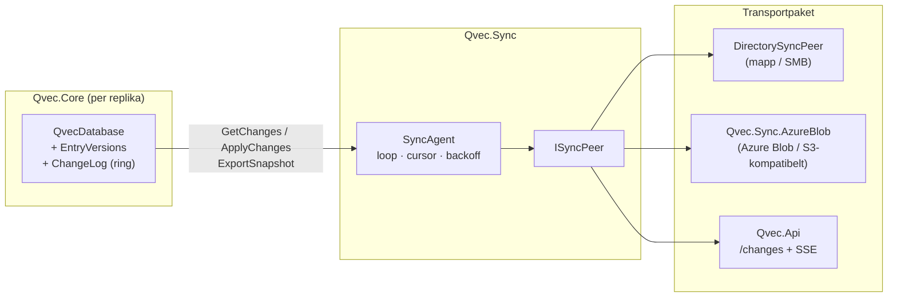

# Design: Sync Engine — replikering mellan Qvec-instanser

Status: **design, ej implementerad**. Ersätter ett tidigare förslag (Azure Append Blob + Web PubSub + wrappande `QvecSyncAgent`) som förkastades av skälen i [avsnitt 2](#2-varför-det-tidigare-förslaget-förkastades).

## 1. Mål och avgränsning

Qvec är och förblir en **inprocess-databas i en enda fil**. Sync är ett opt-in-lager som låter flera instanser konvergera mot samma dokumentmängd utan att någon av dem slutar fungera offline.

Mål:

- **Fånga alla skrivningar i kärnan.** `AddEntry`, `AddEntries`, `UpdateVector`, `UpdateMetadata`, `Update`, `Delete` och `Vacuum` ska alla spåras, oavsett vilken väg appen tog. Inget "skriv via agenten annars synkas det inte".
- **Offline-first.** Skrivningar och sökningar sker alltid lokalt. Sync körs när det finns en peer att nå.
- **Deterministisk konfliktlösning** som inte beror på nätverkets ankomstordning eller på synkade klockor.
- **Transport-agnostisk.** Samma kärnmekanism ska fungera mot en mapp/SMB-share, ett objektlager (Azure Blob, S3) och en HTTP-hubb (`Qvec.Api`). Inget molnberoende i `Qvec.Core` eller `Qvec.Sync`.
- **Bootstrap utan omindexering.** En ny nod ska kunna starta från en kopia av `.qvec`-filen (inkl. HNSW-graf) istället för att spela upp historik och bygga om grafen.
- **AOT-ren.** Inget reflection-baserat serialiseringsformat på trådens väg.

Icke-mål (v1):

- Per-fält-merge av metadata. Dokumentet är atomen.
- Realtid under 100 ms. Pollning på sekundnivå räcker; push är en optimering på transportnivå.
- Multi-master med kausala garantier. Vi lovar *konvergens* (alla replikor landar i samma tillstånd), inte att alla mellanliggande tillstånd är synliga.
- Kryptering/signering av loggsegment. Lagrets egen åtkomstkontroll antas räcka i v1.

## 2. Varför det tidigare förslaget förkastades

| Brist | Konsekvens |
|---|---|
| Sync bara via `QvecSyncAgent.AddEntryAsync` m.fl. | Ett `db.AddEntry` direkt mot databasen synkas tyst inte. Divergens som är svår att upptäcka. |
| Byte-offset i en global Append Blob som cursor | Kan inte komprimeras, 50 000-blockstak, ny klient måste spela upp *all* historik inkl. raderade dokument (~6,7 GB för 1M × 1536-dim). |
| Ingen version per dokument | LWW avgörs av serverns ankomstordning. En klient som var offline och uppdaterade doc X lokalt får sin nyare ändring överskriven av en äldre remote-ändring den hämtar senare. |
| Utgående kö i minnet | Krasch mellan lokal skrivning och sändning tappar ändringen permanent. |
| Azure Functions + Append Blob + Web PubSub som enda väg | Molnlåsning i ett bibliotek vars poäng är "ingen server". |
| Ingen snapshot-väg | HNSW byggs om på varje ny nod (170 s @ 1M på referensmaskinen) trots att filen redan är självbärande. |

Gemensam nämnare: **kärnan saknar replika-identitet, monoton sekvens och version per dokument**. Det är det som måste byggas först, och det är det som gör transporten utbytbar.

## 3. Arkitektur i korthet



Tre lager, tre paket:

| Lager | Paket | Ansvar |
|---|---|---|
| Ändringsspårning | `Qvec.Core` | Version per dokument, ringlogg, `GetChanges`/`ApplyChanges`, snapshot-export. Inga nätverksberoenden. |
| Synkloop | `Qvec.Sync` | `SyncAgent`, `ISyncPeer`, cursor-fil, wire-format, `DirectorySyncPeer`. Beroende: bara `Qvec.Core`. |
| Transporter | `Qvec.Sync.AzureBlob`, ev. `Qvec.Api` | Konkreta peers. Isolerade så att `Qvec.Sync` förblir beroendefritt. |

Topologier som faller ut utan extra kod:

- **Serverlös buss** — alla replikor pekar på samma mapp/blob-container. Varje replika skriver under eget prefix, läser alla andras.
- **Hubb** — en `Qvec.Api`-instans är peer för alla; hubben är själv en fullvärdig, sökbar replika.
- **Ledare + read replicas** — hubb där edge-noderna bara pullar. Bootstrap via snapshot ger edge en färdig HNSW-graf.

## 4. Kärnan: ändringsspårning i filformatet

### 4.1 Nya headerfält (i reserverat område, offset 184–511)

| Fält | Typ | Offset | Beskrivning |
|---|---|---|---|
| `ReplicaId` | Guid | 184 | Denna fils identitet. Sätts vid skapande; byts av `AdoptAsReplica`. |
| `ChangeSeq` | long | 200 | Senast tilldelade lokala sekvensnummer (monotont, aldrig återanvänt). |
| `ChangeLogHead` | long | 208 | Ringens skrivposition (record-index). |
| `ChangeLogCount` | long | 216 | Antal giltiga records i ringen (≤ kapacitet). |
| `LastHlc` | long | 224 | Senast utgivna HLC, för monotonicitet över omstart. |
| `TrackingEnabledUnixSeconds` | long | 232 | När spårning slogs på (diagnostik). |

Ny flagga: `V4HeaderFlags.HasChangeTracking = 1 << 3`.

**Formatversion.** Filer *utan* spårning skrivs fortfarande som version 5 och förblir läsbara av 2.0.0. Filer *med* spårning skrivs som **version 6**. Skälet är säkerhet, inte nödvändighet: en 2.0.0-läsare skulle öppna en version-5-fil med spårning utan fel, skriva rader utan att uppdatera loggen och tyst korrumpera replikeringen. Version 6 gör att äldre läsare avvisar filen med ett tydligt fel. En 2.1-läsare läser 5 och 6.

### 4.2 Nya sektioner

| Sektion | Id | Elementstorlek | Flaggor | Innehåll |
|---|---|---|---|---|
| `EntryVersions` | 11 | 24 B × `MaxCount` | Present, Mutable, MayMoveOnGrow | Per rad: `Hlc` (8) + `Origin` (16). Skrivs tillsammans med raden. |
| `ChangeLog` | 12 | 64 B × kapacitet | Present, Mutable, MayMoveOnGrow | Ringbuffert av `ChangeRecord`. |

`ChangeRecord` (64 B):

```
offset  size  fält
0       8     Seq          lokalt sekvensnummer
8       8     Hlc          version (se 4.3)
16      16    DocumentId
32      16    Origin       ReplicaId som skapade versionen
48      1     Type         1=Upsert, 2=Delete
49      15    reserverat (0)
```

Loggen bär **inte** payload. För `Upsert` hämtas aktuell vektor/metadata från den levande raden vid `GetChanges`. Det gör loggen billig (64 B/ändring, 64 MB för 1M records) och ger automatisk koalescering: tio uppdateringar av samma dokument blir ett `Upsert` med senaste tillståndet. Priset är att mellanliggande versioner inte kan återskapas — vilket är exakt LWW-semantiken vi vill ha.

**Kapacitet** = `MaxCount` records som default (konfigurerbart via `ChangeTrackingOptions.LogCapacity`). Växer med `CreateGrown`. När ringen är full skrivs det äldsta över; en peer vars cursor pekar före `oldestSeq` får `SyncCursorTooOldException` och måste bootstrappa via snapshot. Det är samma avvägning som WAL-retention i Postgres, och den ska stå i README.

**Varför en ring i filen och inte en sidecar-logg?** Sidecar bryter "en fil"-löftet, förlorar atomiciteten med `CommitHeader`, och komplicerar `Vacuum`/`File.Move`. Ringen kostar bara plats.

### 4.3 Version: hybrid logical clock

`Hlc` är 64 bitar: övre 48 = fysisk tid i ms sedan Unix-epok, nedre 16 = logisk räknare.

```
lokal händelse:      pt = max(nowMs, last.pt); c = (pt == last.pt) ? last.c + 1 : 0
mottagen version v:  pt = max(nowMs, last.pt, v.pt); c = pt == last.pt && pt == v.pt ? max(last.c, v.c)+1
                                                       : pt == last.pt ? last.c+1
                                                       : pt == v.pt    ? v.c+1 : 0
```

Total ordning: `(Hlc, Origin)` lexikografiskt. Två replikor kan aldrig ge samma `(Hlc, Origin)` eftersom `Origin` skiljer. Klockskev tolereras: en replika med klockan 10 min fram "vinner" konflikter under de tio minuterna, men systemet konvergerar ändå och HLC:n hos mottagarna hoppar fram så att deras nästa skrivning blir nyare. `LastHlc` persisteras i headern så att en omstart aldrig ger ut en äldre version än den senast utgivna.

### 4.4 Tombstoner

Raderade slots återanvänds direkt av `AllocateSlot`, så raden kan inte bära tombstonens version. Istället:

- `Delete` skriver ett `ChangeRecord` av typ `Delete` med ny `Hlc`.
- Vid `Open` läses ringen och en `Dictionary<Guid, (Hlc, Origin)> _deletedVersions` byggs för alla `Delete`-records vars dokument inte lever.
- `ApplyChanges` med ett `Upsert` för ett dokument som finns i `_deletedVersions` med nyare version → skippas (raderingen vinner).
- Tombstone-retention = loggens retention. Ett `Delete`-record som roterat ut ur ringen är glömt; en peer som är så gammal bootstrappar ändå från snapshot.

### 4.5 Lokala mutationer

Alla går redan genom `_lock.EnterWriteLock()` och slutar med `CommitHeader()`. Tillägget per operation:

| Operation | Tillägg |
|---|---|
| `AddEntryInternal` | Stampa `EntryVersions[slot] = (NextHlc(), ReplicaId)`; append `Upsert`. |
| `UpdateVector` / `UpdateMetadata` / `Update` | Ny version på den nya raden; append `Upsert`. |
| `Delete` | Append `Delete` med ny version; lägg i `_deletedVersions`. |
| `AddEntries` (parallell) | Versioner och seq tas ut under kort lås före graf-arbetet; loggappend sker i insättningsordning inom batchen. |
| `Vacuum` | Kopierar `EntryVersions` per levande rad, kopierar ringen och headerfälten orörda till den nya filen. |
| `CreateGrown` | Lägger ut båda sektionerna med ny kapacitet; kopierar ringen (packad, i seq-ordning). |

Ordning vid skrivning: rad → version → loggrecord → `CommitHeader` (bumpar `ChangeSeq`, `ChangeLogHead`, `ChangeLogCount`, `LastHlc`). Ett record bortom `ChangeLogCount` efter krasch ignoreras, på samma sätt som en rad bortom `CurrentCount`.

### 4.6 Apply av remote-ändringar

```csharp
public ApplyResult ApplyChanges(ChangeBatch batch);  // under write lock
```

Per post i batchen:

1. Slå upp lokal version: levande rad → `EntryVersions`; annars `_deletedVersions`; annars "okänd".
2. Om `remote.Version <= local.Version` → `Skipped` (idempotent; gäller även våra egna ändringar som kommer tillbaka via en peer).
3. `Upsert`: om raden lever → `Update`-väg (soft-delete + ny rad); annars `AddEntryInternal` med `externalId`. Versionen som stämplas är **remote-versionen**, inte en ny lokal. Ett `Upsert`-record appendas ändå i *vår* logg (med vår `Seq`, remote `Hlc`/`Origin`) så att våra egna peers ser ändringen.
4. `Delete`: soft-delete om raden lever; lägg `_deletedVersions[id] = remote.Version`; append `Delete`.
5. HLC:n "tickas" med remote-versionen (4.3) så att nästa lokala skrivning blir nyare.

`ApplyResult` returnerar `Applied`, `Skipped`, `Rejected` (t.ex. dim-fel) per post plus totalsummor. Fältindex uppdateras om ett `Func<string, IEnumerable<(string, string)>>`-extractor är registrerat (ny `db.FieldIndexExtractor`-egenskap; idag skickas extractorn bara till `RebuildFieldIndex`).

### 4.7 Läsning av ändringar

```csharp
public ChangeBatch GetChanges(long sinceSeq, int maxItems, Guid? excludeOrigin = null);  // under read lock
public long OldestChangeSeq { get; }
public long ChangeSeq { get; }
```

- Kastar `SyncCursorTooOldException(oldestSeq)` om `sinceSeq < OldestChangeSeq - 1`.
- Går ringen från `sinceSeq + 1` till `ChangeSeq`, koalescerar per `DocumentId` (behåll senaste), hoppar över records med `Origin == excludeOrigin` (undviker att skicka tillbaka en peers egna ändringar), och bygger payload:
  - Levande rad → `Upsert` med floats (om filen har floats) eller int8-koder + per-vektor-parametrar (ren int8) + metadata.
  - Ej levande → `Delete`.
- `ChangeBatch.ToSeq` är det sista inkluderade `Seq`; klienten sparar det som cursor först *efter* lyckad push/apply.

### 4.8 Snapshot

```csharp
public SnapshotInfo ExportSnapshot(Stream destination);   // under write lock: commit header, kopiera hela filen från mappningen
public readonly record struct SnapshotInfo(Guid SourceReplicaId, long ChangeSeq, long Length);
public static void AdoptAsReplica(string path, Guid newReplicaId, out Guid sourceReplicaId, out long sourceSeq);
```

`ExportSnapshot` ger en bit-exakt kopia med `ReplicaId = källan`, `ChangeSeq = N`. Mottagaren kör `AdoptAsReplica` som byter `ReplicaId`, behåller alla versioner och ringen, och returnerar `(källa, N)` så att agenten kan sätta cursorn `{källa → N}`. Från den punkten pullas bara deltat. Ingen omindexering. Filen kopieras direkt ur minnesmappningen eftersom den öppna filen hålls med `FileShare.None`; skrivare blockeras under kopieringen, läsare inte. `AdoptAsReplica` kräver att filen är stängd, vägrar otrackade filer och vägrar samma id som filen redan har (två replikor med samma identitet skulle skippa varandras skrivningar som "egna").

### 4.9 Aktivering på befintlig fil

`db.EnableChangeTracking(ChangeTrackingOptions)` gör en relayout (samma mekanism som `CreateGrown`), sätter `ReplicaId`, stämplar alla levande rader med `(NextHlc(), ReplicaId)` och skriver ett `Upsert`-record per rad. Filen blir version 6. Detta är avsiktligt "en stor initial ändringsmängd": första peern som pullar får alla dokument. Dokumenteras.

### 4.10 Kompatibilitetsregler för payload

| Källa | Payload | Mottagare `None`/`Int8Rescored` | Mottagare `Int8` |
|---|---|---|---|
| `None` / `Int8Rescored` | floats | ✅ | ✅ (kvantiserar lokalt) |
| `Int8` | koder + parametrar | ❌ `Rejected` per post, tydligt fel | ✅ |

Dimensioner måste matcha; annars avvisas hela batchen. Avståndsfunktion behöver inte matcha (varje replika indexerar med sin egen).

### 4.11 Prestandapåverkan utan sync

Spårning är **opt-in** — via `ChangeTrackingOptions` i konstruktorn eller `EnableChangeTracking` på en befintlig fil — och aldrig på som default. En databas som bara körs inprocess utan peers hamnar i ett av två lägen:

**Spårning av (default).** Ingen påverkan. Inga nya sektioner, headerfälten är noll, filen förblir version 5. Acceptanskriterium för PR 1: nya filer utan spårning är byte-identiska med 2.0.0. Kodvägen får en enda `if (_tracking)`-gren per mutation; sökvägen rörs inte.

**Spårning på, ingen peer.** Kostnaden är den här — och den ska mätas i `sync-docs`, inte påstås:

| Väg | Påverkan | Kommentar |
|---|---|---|
| Sökning | **Ingen.** | Varken `EntryVersions` eller `ChangeLog` läses på frågevägen. Samma regel som håller `MemoryMappedViewAccessor` borta därifrån. |
| Skrivning | +24 B version + 64 B loggpost + en HLC-tick (`UtcNow` och några heltalsoperationer) per mutation. | Nanosekunder mot en HNSW-insättning på µs–ms. Benchmark `AddEntries` 1M med/utan spårning avgör. |
| Disk | +88 B per rad (+ ringens kapacitet). | 1536-dim float (6 KB/rad): **1,4 %**. 128-dim ren int8 (~130 B/rad): **~70 %** — ska stå i README. |
| `Open` | Ringen läses en gång för att bygga `_deletedVersions`. | O(loggkapacitet); ~64 MB @ 1M records, tiotals ms. |
| Minne | `_deletedVersions` växer med antal raderingar som ligger kvar i ringen. | ~40 B per post. Töms i takt med att `Delete`-records roterar ut. |
| `Vacuum` / grow | Kopierar två sektioner till. | Sekventiell kopiering; marginellt mot omkvantisering och grafskrivning. |

Regel för implementationen: allt spårningsarbete sker under det skrivlås som redan hålls, efter att raden är skriven och före `CommitHeader`. Inget nytt lås, ingen ny allokering per mutation (loggposten skrivs direkt i mappningen).

## 5. `Qvec.Sync`

### 5.1 `ISyncPeer`

```csharp
public interface ISyncPeer : IAsyncDisposable
{
    Guid PeerId { get; }
    Task<ChangeBatch?> PullAsync(SyncCursor cursor, int maxItems, CancellationToken ct);
    Task PushAsync(ChangeBatch batch, CancellationToken ct);
    Task<Stream?> OpenSnapshotAsync(CancellationToken ct);              // null = stöds ej
    IAsyncEnumerable<SyncSignal> WatchAsync(CancellationToken ct);      // default: tom → agenten pollar
}
```

`SyncCursor` är en vektorklocka `Dictionary<Guid, long>` (replika → senast sedda `Seq`). För en hubb finns en post; för en buss en per replika.

### 5.2 `SyncAgent`

```csharp
await using var agent = new SyncAgent(db, peer, new SyncOptions
{
    StatePath = "local.qvec.sync",          // cursor + egen push-position, atomisk skrivning
    PollInterval = TimeSpan.FromSeconds(5),
    BatchSize = 500,
    BootstrapFromSnapshotIfBehind = true,
    FieldIndexExtractor = null,
});
await agent.StartAsync();
```

Loop per iteration:

1. **Push**: `db.GetChanges(state.PushedSeq, BatchSize, excludeOrigin: peer.PeerId)` → `peer.PushAsync` → `state.PushedSeq = batch.ToSeq` → spara state.
2. **Pull**: `peer.PullAsync(state.Cursor)` → `db.ApplyChanges` → uppdatera cursor → spara state.
3. Vid `SyncCursorTooOldException` från peer och `BootstrapFromSnapshotIfBehind`: hämta snapshot, `AdoptAsReplica`, öppna om databasen (agenten äger då `QvecDatabase`-livscykeln — se öppen fråga 7.3).
4. Exponentiell backoff vid nätverksfel (1 s → 60 s), återställs vid lyckad iteration.
5. `WatchAsync`-signaler kortsluter väntan på nästa iteration.

State-filen skrivs med temp + rename. Om den saknas startar agenten med tom cursor och `PushedSeq = 0` (skickar allt, mottagaren skippar idempotent).

### 5.3 Wire-format `ChangeBatch`

Binärt, versionerat, AOT-rent (ingen reflection):

```
"QVCB" (4) | FormatVersion u16 | Flags u16 (bit0 = Brotli-komprimerad body)
Dim i32 | PayloadKind u8 (1=Float, 2=Int8) | Count i32 | FromSeq i64 | ToSeq i64 | Origin Guid
Body: Count × { Type u8 | DocumentId 16 | Hlc i64 | Origin 16 | [vector] | MetadataLen i32 | UTF-8 }
Crc32 (4) över allt ovan
```

Body komprimeras med Brotli om `Flags.bit0` — metadata komprimerar bra, vektorer knappt; agenten väljer per batch utifrån metadataandel (tröskel 20 %).

### 5.4 `DirectorySyncPeer`

Ingår i `Qvec.Sync`. Layout i målmappen:

```
<root>/
  replicas/<replicaId>/
    log/<fromSeq:D20>-<toSeq:D20>.qvcb      immutable segment
    snapshot/<seq:D20>.qvec                 valfritt, senaste behålls
  manifest/<replicaId>.json                 { latestSeq, snapshotSeq, updatedUtc }
```

`PushAsync` skriver segment till `.tmp` och byter namn. `PullAsync` listar `replicas/*` utom egen, läser manifest, hämtar segment med `toSeq > cursor[replica]`. Fungerar identiskt på lokal disk, SMB och — via `Qvec.Sync.AzureBlob` — i en blob-container. Den här peeren är också **testtransporten**: två `QvecDatabase` i samma process, en temp-mapp, ingen nätverkskod.

### 5.5 `Qvec.Sync.AzureBlob`

Samma layout som 5.4 över `BlobContainerClient`. Segment via `UploadAsync(overwrite: false)`; manifest via ETag-villkorad skrivning. Snapshot som block blob. `WatchAsync` = tom i v1 (pollning). Separat NuGet-paket så att `Qvec.Sync` inte drar in `Azure.Storage.Blobs`.

### 5.6 `Qvec.Api` som hubb (valfritt, senare)

- `GET  /api/changes?since=&max=` → `ChangeBatch` (octet-stream)
- `POST /api/changes` → `ApplyResult`
- `GET  /api/snapshot` → filström
- `GET  /api/changes/stream` → SSE med `{ "seq": N }` vid varje commit

`HttpSyncPeer` i `Qvec.Sync` (bara `HttpClient`, inget extra beroende). Hubben pullar aldrig — klienterna pushar och pullar.

## 6. Implementationsplan

Principer från tidigare faser gäller: **tester först**, noll varningar, snabb CI + `Slow`-svit gröna, en PR per rad nedan, squash-merge, dokumentation i samma PR. Alla PR:ar utom nr 6 är testbara utan nätverk.

| # | Branch | Innehåll | Tester (skrivs först) | Klart när |
|---|---|---|---|---|
| **1** ✅ #36 | `sync-versions` | Headerfält 4.1, flagga, formatversion 6 villkorad på spårning, `EntryVersions`-sektion, HLC-klass, `ReplicaId`. Stämpling i alla lokala mutationer. `Vacuum`/`CreateGrown` bevarar. `EnableChangeTracking` på tom och på befintlig fil. | `Format/ChangeTrackingHeaderTests`: fälten round-trippar, CRC, v5-fil utan spårning öppnas av 2.0.0-läsare (simulerat via versionskontroll), v6 avvisas av "gammal" läsare. `HlcTests`: monotonicitet, tick-regler, `LastHlc` över omstart. `EntryVersionTests`: version följer GUID genom `UpdateVector`, överlever `Vacuum` och grow. | Alla befintliga tester gröna; nya filer utan spårning är byte-identiska med 2.0.0; `AddEntries` 1M utan spårning inom mätbrus mot 2.0.0 på referensmaskinen. |
| **2** ✅ #37 | `sync-changelog` | `ChangeLog`-ring, `ChangeRecord`, `Delete`-tombstoner, `_deletedVersions`, `GetChanges` med koalescering och `excludeOrigin`, `ApplyChanges` med LWW, `OldestChangeSeq`, `SyncCursorTooOldException`. Fältindex-extractor som egenskap. Ta bort `SyncFrom` (ersätts; markera `[Obsolete]` i 2.1, ta bort i 3.0). | `ChangeLogTests`: append, rotation, krasch-simulering (record bortom count ignoreras), packning vid grow. `GetChangesTests`: koalescering, delete efter upsert, cursor för gammal. `ApplyChangesTests`: idempotens, LWW båda riktningar, delete vinner över äldre upsert, upsert vinner över äldre delete, egen ändring tillbaka = skipped, dim-fel = rejected, int8→float = rejected, float→int8 = applied. **Konvergenstest**: två databaser, slumpade interleavade mutationer offline, byt batchar i båda riktningar tills tomt → identisk `(Guid, Version, Metadata)`-mängd. | Konvergenstestet grönt 1 000 iterationer med seed-loggning. |
| **3** ✅ | `sync-snapshot` | `ExportSnapshot`, `AdoptAsReplica`. | Snapshot-fil öppnas, är hälsosam, har källans `ReplicaId`/`ChangeSeq`; efter `Adopt` nytt id, versioner intakta; delta från `sourceSeq` ger konvergens utan dubbletter. | Bootstrap 1M-fil = filkopiering, ingen omindexering (Slow-test mäter). |
| **4** | `sync-agent` | Nytt projekt `Qvec.Sync`: `ISyncPeer`, `SyncCursor`, `ChangeBatch`-wire (5.3) med Brotli, `SyncAgent` (5.2) med state-fil och backoff, `DirectorySyncPeer` (5.4). NuGet-metadata, AOT-kompilering i CI (som `Qvec.Core`). | `ChangeBatchWireTests`: round-trip, CRC-fel, versionsfel, komprimerad/okomprimerad. `DirectorySyncPeerTests`: segmentnamn, tmp+rename, manifest, ignorerar egen prefix. `SyncAgentTests` (in-process, temp-mapp): två agenter konvergerar; tre agenter i stjärna; agent startad utan state skickar allt och mottagaren skippar; agent bakom ringen bootstrappar från snapshot; state-fil korrupt → tydligt fel; avbryt mitt i → återupptar. | Exempel i `samples/` som kör två processer mot samma mapp. |
| **5** | `sync-docs` | README: nytt avsnitt "Sync" med ärlig text om LWW, ringretention, klockskev och payload-kompatibilitet. `docs/design-format.md`: sektion 11/12, headerfält, version 6. `benchmarks/README.md`: kostnad för spårning (skrivgenomströmning med/utan). Roadmap uppdaterad. | Benchmark: `AddEntries` 1M med och utan spårning; `GetChanges` 100k; `ApplyChanges` 100k. | Ingen påstådd siffra utan mätning på referensmaskinen. |
| **6** | `sync-azure-blob` | Nytt paket `Qvec.Sync.AzureBlob` med `BlobSyncPeer` (5.5). | Integrationstester mot Azurite i CI (`Slow`), samma testsvit som `DirectorySyncPeer` via delad abstrakt testklass. | Publiceras som eget NuGet-paket. |
| **7** | `sync-api-hub` | `Qvec.Api` endpoints (5.6) + `HttpSyncPeer`. | `Qvec.Api.Tests` med `WebApplicationFactory`: push/pull/snapshot/SSE; auth via befintlig API-nyckel. | Valfritt; kan skjutas till efter release. |

**Release-plan.** PR 1–5 ⇒ **2.1.0** (`Qvec.Core` + nytt `Qvec.Sync`). PR 6 ⇒ `Qvec.Sync.AzureBlob` 2.1.0. PR 7 ⇒ 2.2.0. `SyncFrom` tas bort i 3.0.

**Beroendeordning.** 1 → 2 → 3 → 4 → 5 strikt. 6 och 7 är oberoende av varandra men kräver 4.

**Uppskattad omfattning** (i samma enhet som tidigare faser, dvs. PR:ar av den storlek vi kört): 1 och 2 är störst (kärnan, formatet, konvergenstestet); 3 liten; 4 medel; 5 liten men kräver benchmark-körningar; 6 medel (Azurite-uppsättning); 7 medel.

## 7. Öppna frågor

Beslut föreslås; avvikelse ändrar planen ovan.

1. **Loggkapacitet.** Förslag: `MaxCount` records (64 B vardera). Alternativ: tidsbaserad retention — svårare att garantera i en ring; avråds.
2. **Version 6 villkorad på spårning** (4.1) kontra alltid 6 i 2.1. Förslag: villkorad, så att 2.0.0-läsare kan läsa ospårade 2.1-filer.
3. **Vem äger `QvecDatabase` vid snapshot-bootstrap?** Agenten måste stänga och öppna om filen. Förslag: `SyncAgent` tar en `Func<QvecDatabase>`-fabrik och exponerar `agent.Database`; alternativt kastar agenten `SnapshotRequiredException` och låter appen sköta det. Fabriken är bekvämare; undantaget är explicitare. Förslag: fabrik, med undantaget som fallback när ingen fabrik givits.
4. **`excludeOrigin` vid buss-topologi.** På en buss pushar varje replika sitt eget segment; ett `Upsert` som replikan tog emot från B ska inte skrivas till A:s segment (B har det redan). Men C som bara ser A:s segment missar då B:s ändring om C inte också läser B:s prefix. Regel: på bussen läser alla alla prefix, och `excludeOrigin` används **inte** vid push (bara mot hubb). Agenten får `SyncTopology { Hub, Bus }`.
5. **Ren int8 → float-mottagare** avvisas (4.10). Alternativ: tillåt med dekvantiserad vektor och en `Approximate`-flagga i versionen. Förslag: avvisa i v1; det är ärligare.
6. **`AddEntries` parallell + logg.** Loggappend i insättningsordning kräver att seq tas ut i ordning men graf-arbetet kan ske parallellt. Förslag: ta ut `(slot, seq, hlc)` för hela batchen under låset först, som redan görs för slots.
7. **Kryptering av segment** i buss-läge. Förslag: utanför v1; dokumentera att lagrets ACL är säkerhetsgränsen.

## 8. Relaterade dokument

- [Filformat](design-format.md) — sektionstabell, header, `CreateGrown`. Aktuell headerversion är 5; layouten kallas "v4" i det dokumentet.
- [Guid som dokument-ID](design-guid-id.md) — `externalId`, dedup.
- [Update & Delete](design-update-delete.md) — soft delete, slot-återanvändning.
- [Int8-kvantisering](design-quantization-int8.md) och [rescoring](design-quantization-rescoring.md) — payload-kompatibilitet.
